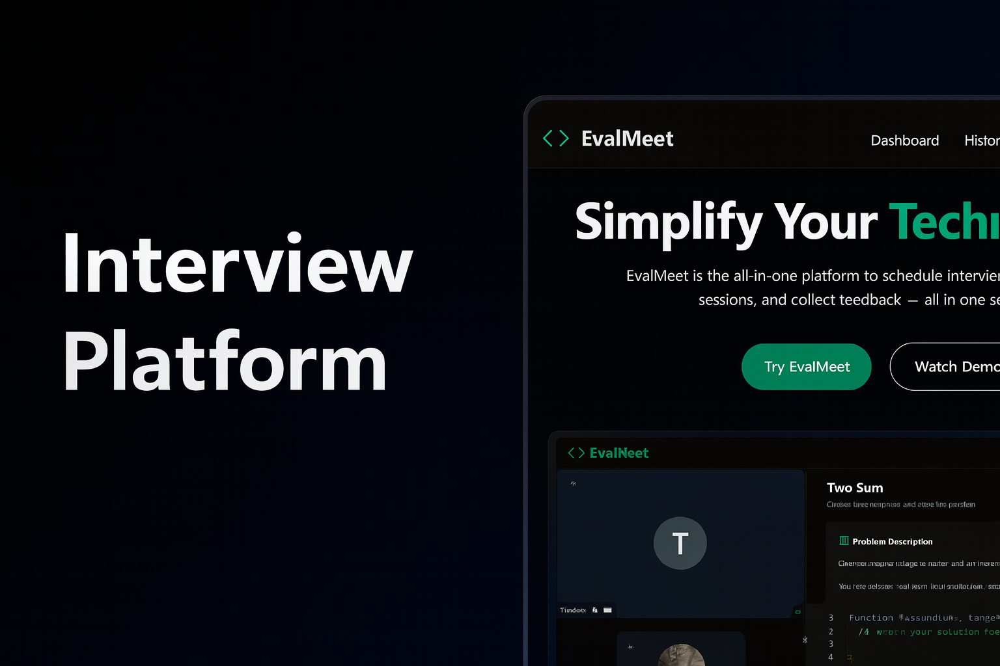

# 🎥💬 EvalMeet —  Technical Interview Platform

<div align="center">
  <a href="https://evalmeet.vercel.app/" target="_blank">
    
  </a>

  <br /><br />

  <div>
    
    
    
    
    <br/>
    
    
    
  </div>

  <br />

  <h3 align="center">Real-Time Interviews. Collaboration. Scheduling. Recording. All in One Platform.</h3>

  <a href="https://evalmeet.vercel.app/" target="_blank">
    🔥 <b>Live Demo</b>
  </a>
</div>

---

##  Table of Contents

-  [Introduction](#introduction)
-  [Tech Stack](#tech-stack)
-  [Features](#features)
-  [Quick Start](#quick-start)
-  [Architecture Overview](#architecture-overview)
-  [Directory Overview](#directory-overview)
-  [Deployment](#deployment)
-  [Contributing](#contributing)
-  [Contact](#contact)

---

##  1. Introduction

**EvalMeet** is a powerful, modern platform designed for seamless technical interviews with:

- Real-time video calls  
- Collaborative coding  
- Commenting & feedback  
- Scheduling workflows  
- Automatic recording & playback  
- Admin dashboards  
- Beautiful UI powered by Tailwind + Shadcn  

Built with **Next.js 14**, **Convex**, **Clerk**, and **Stream Video SDK**, EvalMeet provides a production-ready interview environment for teams, bootcamps, and organizations.

---

##  2. Tech Stack

### **Frontend**
- Next.js 14 (App Router)
- Shadcn/UI
- TailwindCSS
- TypeScript

### **Backend**
- Convex (realtime DB + functions)
- Stream Video SDK
- Clerk Authentication

### **Infrastructure**
- Vercel (hosting)
- Convex Cloud
- Stream Cloud Services

---

##  3. Features

###  **Real-Time Video Rooms**
- HD Stream-powered video  
- Auto device setup  
- Participant state tracking  
- Smooth join/leave UX  

###  **Interview Tools**
- Integrated collaborative code editor  
- Comment dialogs  
- Realtime updates via Convex  

###  **Scheduling System**
- Create/edit interview sessions  
- Dashboard for upcoming meetings  
- Unified meeting management  

###  **Recordings**
- Automatic session recording  
- Playback UI  
- Timestamps + metadata  

###  **Admin Dashboard**
- Manage interviews  
- View recordings  
- Track user activity  

###  **Dark/Light Theme**
- Built-in theme switch using Shadcn  

---

##  4. Quick Start

- ###  Clone the Repository
```bash
git clone https://github.com/Pratham22R/EvalMeet.git
cd pratham22r-evalmeet
```
- ###  Install Dependencies
```bash
npm install
```
- ###  Add Environment Variables
```bash
#Create a .env.local file:

NEXT_PUBLIC_CLERK_PUBLISHABLE_KEY=
CLERK_SECRET_KEY=
CLERK_WEBHOOK_SECRET=
NEXT_PUBLIC_CLERK_FRONTEND_API_URL=

CONVEX_DEPLOYMENT=
NEXT_PUBLIC_CONVEX_URL=

NEXT_PUBLIC_STREAM_API_KEY=
STREAM_SECRET_KEY=
```
- ###  Start Development Server
```bash
npm run dev
```
- ###  Link on which app is running
```bash
http://localhost:3000
```
---

##  5. Architecture Overview

### **Frontend (Next.js)**

- App Router
- Server + client components
- Shadcn UI

### **Backend (Convex)**

- Realtime queries/mutations
- Data models for interviews, comments, recordings

### **Video Layer (Stream)**

- Room creation
- Recording pipeline
- Device & participant lifecycle

### **Auth Layer (Clerk)**

- User identity
- Route protection

---

##  6. Directory Overview

```bash
pratham22r-evalmeet/
├── convex/
│   ├── auth.config.ts
│   ├── comments.ts
│   ├── interview.ts
│   ├── users.ts
│   └── schema.ts
├── src/
│   ├── app/
│   │   ├── (auth)/sign-in
│   │   ├── (auth)/sign-up
│   │   ├── (admin)/dashboard/
│   │   ├── meeting/
│   │   ├── recordings/
│   │   └── schedule/
│   ├── components/
│   │   ├── CodeEditor.tsx
│   │   ├── MeetingRoom.tsx
│   │   ├── RecordingCard.tsx
│   │   └── ui/
│   ├── providers/
│   ├── constants/
│   └── hooks/
├── public/
└── package.json
```

---

##  7. Deployment

### **EvalMeet is optimized for:**

- Vercel → Frontend
- Convex Cloud → Backend
- Stream Cloud → Video + Recording

### **Deploy Your Own**

- Fork repo
- Import to Vercel
- Add environment variables
- Deploy 

---

## 8. Contributing

### **Contributions welcome!**

**Steps:**

- Fork
- Create feature branch
- Commit
- Open PR

---

## 9. Contact

- 🌐 [Portfolio](https://pratham-portfolio-op6k.onrender.com)

- 💼 [LinkedIn](https://www.linkedin.com/in/pratham-raghuvanshi-9b782127b)

- 🐙 [GitHub](https://github.com/Pratham22R)

---

## 10. ⭐ Show Support

If you like EvalMeet, consider giving the repo a star 🌟
Your support helps the project grow!

---

**Made with ❤️ by Pratham**